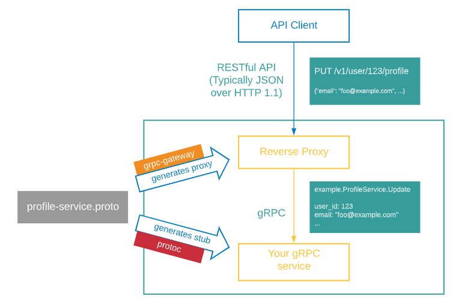

# Grpc-gateway simple example

Простой пример "Приветствие". Описание простого proto файла, генерация кода с помощью компилятора buf. И простой код для запуска grpc сервера и клиента с проксирование http запросов.

Из особенностей. Все сторонние зависимости перенесены в репозиторий поскольку существует ограничения на запуск `buf mod update` команда не выполниться, из за ограничения доступа.

Так же разнесена генерация клиента, сервера и api swagger на три различных конфигурации. И создание двух команд генерации под клиент и сервер. Как продолжение темы клиент может быть как отдельный модуль go со своей версией что позволяет сторонним сервисам легко переиспользовать клиента, не опасаясь за целостность и актуальность.

*ps*
Много было сложностей с работой buf и настройкой модулей buf, в особенности с ограничением доступа к документации и некоторым командам комп. buf.

## Перегенерация grpc

*сервер и описание swagger*

```bash
make buf-gen
```

*client*

```bash
make buf-gen-client
```

Более подробно о работе команд в файл `Makefile`

## Как запустить

```bash
make run
```

Пробный запрос после запуска.

```bash
curl -X GET  http://localhost:8090/v1/sayhello?name=vasa
```

```bash
{"message":"vasa world"}
```

## GRPC Client

Опишем простой пример реализации grpc клиента.

После инициализации модуля, установим клиент grpc-gateway-eaxample:

```bash
go get github.com/viktor-titov/grpc-gateway-example/client@v0.1.0
```

Далее в главном пакете или в точке запуска создадим grpc соединение и создадим нового клиента. Там же вызовим единственный описанный метод Клиента:

```go
package main

import (
 "context"
 "flag"
 "fmt"
 "log"
 "time"

 ggeClient "github.com/viktor-titov/grpc-gateway-example/client"

 "google.golang.org/grpc"
 "google.golang.org/grpc/credentials/insecure"
)

var (
 addr = flag.String("addr", "localhost:8080", "the address to connect to")
 name = flag.String("name", "test", "Name to greet")
)

func main() {
 flag.Parse()

    // Создаем grpc клиента.
 conn, err := grpc.NewClient(*addr, grpc.WithTransportCredentials(insecure.NewCredentials()))
 if err != nil {
  log.Fatalf("did not connect: %v", err)
 }
 defer conn.Close()

    // Создаем клиента grpc-gateway-example
 client, err := ggeClient.NewClient(conn)

 ctx, cancel := context.WithTimeout(context.Background(), time.Second)
 defer cancel()

    // Запуск метода с передачей нашего имени.
 res, err := client.SayHello(ctx, *name)
 if err != nil {
  log.Fatalf("method SayHello: %v", err)
 }

    // Результат запроса к клиенту.
 fmt.Println(res.Message)
}
```

## Более расширенное описание

### Что такое gRPC-Gateway

gRPC-Gateway это плагин для компилятора [protoc](https://grpc.io/docs/what-is-grpc/introduction/). Это компилятор который преобразует описание в proto файле согласно [Protocol Buffers](https://protobuf.dev/overview/) в набор классов для доступа к данным на нужном вам языке. Так вот gRPC-Gateway это плагин для компилятора `protoc` который согласно gRPC сервисам определяет и генерирует еще `proxy-server` который транслирует `RESTful API` в `gRPC`.

#### ref

- [github gRPC-Gateway](https://github.com/grpc-ecosystem/grpc-gateway?tab=readme-ov-file)
- [docs](https://grpc-ecosystem.github.io/grpc-gateway/)

### Кто такой Buf

Согласно документации `gRPC-Gateway` для генерации кода из `proto` файла мы можем воспользоваться не только компилятором `protoc` у нас есть еще вариант и это [Buf](https://buf.build/docs/introduction) это набор инструментов для сборки.

> [из документации Buf](https://buf.build/docs/introduction) *Buf создает инструменты, которые делают разработку API на основе схемы на основе Protobuf надежной и удобной для производителей и потребителей услуг. Вашей организации не придется изобретать велосипед для работы с Protobuf — наши инструменты упрощают вашу стратегию управления Protobuf, поэтому вы можете сосредоточиться на том, что важно.*


[source pic](https://grpc-ecosystem.github.io/grpc-gateway/)

[Здесь полное описание концепции инструментария `Buf`](https://buf.build/docs/ecosystem-overview). Если своими словами то это набор инструментов который позволяет нам не только генерировать код на нашем языке из `proto` но и проводить проверки синтаксиса, обратной совместимости. С помощью конфигов можно гибко управлять генерацией частей кода, клиент или сервер.

Есть сложность, чтобы разобраться в конфигурационных файлах `buf` нужно поломать голову. Здесь пару наводящих ссылок по ним:
- [buf.yaml v2](https://buf.build/docs/configuration/v2/buf-yaml)
- [buf.lock v2](https://buf.build/docs/configuration/v2/buf-lock)
- [buf.gen.yaml v2](https://buf.build/docs/configuration/v2/buf-gen-yaml)
- [Tutorial buf build](https://buf.build/docs/build/tutorial)

В целом документция достаточно хорошая. Там можно найти туториалы и описание конфг. файлов пошаговые инструкции и описание CLI команд.

#### Сложности

Закрыты для использования для некоторых стран. Закрыта документация, и самое главное их сервис по обнавлению зависимостей через `cli` `buf mod update` что усложняет работу с этим инструментом. На момент написания множество сервисов vpn не помогают для обхода блокировок.

### Статья на Habr про gRPC-Gateway

Мотивация для создания REST шлюза поверх существующего gRPC API может быть разная (альтернативный доступ, удобство тестирования и др.), однако как показывает практика gRPC не всегда хватает.

Дополнить существующий go gRPC сервис можно довольно быстро (от ~10 минут до суток) в зависимости от сложности существующего API, и степени проработанности REST прокси, однако в базовом формате это можно сделать относительно (сравнивая с ручным написанием сериализаторов и сервиса `перевызывающего gRPC`) быстро.

Для нетерпеливых есть репозиторий, в котором есть все необходимые материалы для подключения прокси. Далее идет пошаговый гайд как добавить прокси к существующему сервису.

#### ref

- [source](https://habr.com/ru/articles/658769/)

## References

- [Introduction to the gRPC-Gateway](https://grpc-ecosystem.github.io/grpc-gateway/docs/tutorials/introduction/#introduction-to-the-grpc-gateway)
- [For more examples (it's docs gRPC-Gateway)](https://github.com/johanbrandhorst/grpc-gateway-boilerplate)
- [Source code of example that taken for a basis](https://github.com/iamrajiv/helloworld-grpc-gateway)
